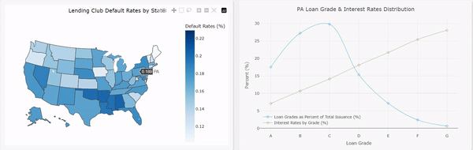
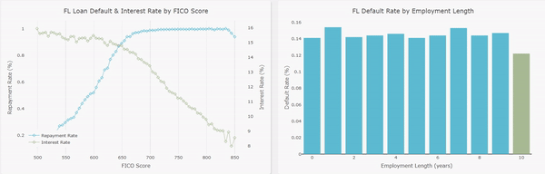
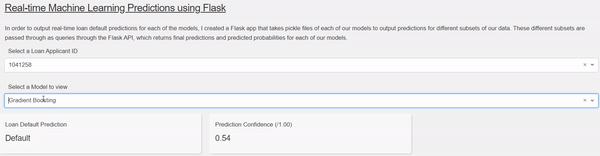

# LendingClub ML App

[](https://python.org)
[](https://docker.com)
[](LICENSE)
[]()

> A comprehensive machine learning application for predicting loan defaults and optimizing investment portfolios using the LendingClub dataset.

## Project Overview

This project demonstrates advanced machine learning techniques applied to financial risk assessment. The application trains multiple classification models on historical LendingClub loan data to predict default probabilities, then uses these predictions to construct an IRR-optimized investment portfolio.

### Key Features

- **Multiple ML Models**: 8+ different algorithms including Logistic Regression, Random Forest, Gradient Boosting, and Neural Networks
- **Interactive Dashboard**: Real-time visualization of loan data, model performance, and portfolio optimization
- **Portfolio Optimization**: IRR-based portfolio construction with customizable investment criteria
- **Live Predictions**: Real-time loan default predictions via REST API
- **Advanced Analytics**: Comprehensive EDA with interactive choropleth maps and statistical analysis

### Business Impact

- **7.40% IRR** for 36-month loans (vs. 6.30% baseline)
- **10.63% IRR** for 60-month loans (vs. 8.11% baseline)
- **1.51% and 0.99% alpha** over baseline for 36-month and 60-month loans respectively
- **Statistically significant** results at 1% confidence level

## Quick Start

### Prerequisites

- Docker & Docker Compose
- Python 3.9+ (for local development)
- Git

### Installation & Running

**Option 1: Docker Compose (Recommended)**
```bash
# Clone the repository
git clone https://github.com/yourusername/LendingClub_ML_App.git
cd LendingClub_ML_App

# Run the entire application
bash build_e2e.sh
```

**Option 2: Manual Docker Build**
```bash
# Build and run backend
docker build -t flask_backend:v1 -f ./app/backend/Dockerfile.backend .
docker run -d -p 5000:5000 --name flask_backend flask_backend:v1

# Build and run frontend
docker build -t dash_frontend:v1 -f ./app/frontend/Dockerfile.frontend .
docker run -d -p 8050:8050 --name dash_frontend dash_frontend:v1
```

**Option 3: Local Development**
```bash
# Backend
cd app/backend
pip install -r requirements_backend.txt
python flask_serve.py

# Frontend (in another terminal)
cd app/frontend
pip install -r requirements_frontend.txt
python app.py
```

### Access the Application

- **Frontend Dashboard**: http://localhost:8050
- **Backend API**: http://localhost:5000
- **API Documentation**: http://localhost:5000/api/v1/predict

## Application Screenshots

### 1. Interactive Choropleth Map - Loan Default Rates by State
<div align="center">
    
</div>

### 2. FICO Score Analysis - Default Rates & Interest Rates
<div align="center">
    
</div>

### 3. Real-time ML Predictions Interface
<div align="center">
    
</div>

## 🔧 API Documentation

### Prediction Endpoint

**POST** `/api/v1/predict`

Predict loan default probability using trained ML models.

#### Request Body
```json
{
    "query": [[feature1, feature2, ..., featureN]],
    "model": "GBC"
}
```

#### Response
```json
{
    "prediction": "No Default",
    "confidence": [0.123, 0.877]
}
```

#### Available Models
- `QDA` - Quadratic Discriminant Analysis
- `LDA` - Linear Discriminant Analysis  
- `LOGIT` - Logistic Regression
- `GBC` - Gradient Boosting Classifier

#### Example Usage
```bash
curl -X POST http://localhost:5000/api/v1/predict \
  -H "Content-Type: application/json" \
  -d '{"query": [[50000, 700, 5, 10]], "model": "GBC"}'
```

## 🏗️ Architecture

```
┌─────────────────┐    ┌─────────────────┐    ┌─────────────────┐
│   Frontend      │    │   Backend       │    │   Data Layer    │
│   (Dash/Flask)  │◄──►│   (Flask API)   │◄──►│   (Pickle Files)│
│   Port: 8050    │    │   Port: 5000    │    │                 │
└─────────────────┘    └─────────────────┘    └─────────────────┘
```

## 📈 Model Performance

| Model | Non-2018 AUC | 2018 AUC | Performance |
|-------|-------------|----------|-------------|
| CatBoost Classifier | 0.892 | 0.841 | 🥇 Best |
| MLP Neural Net | 0.884 | 0.816 | 🥈 Excellent |
| Gradient Boosting | 0.831 | 0.766 | 🥉 Good |
| Random Forest | 0.769 | 0.697 | ✅ Good |

## 🛠️ Development

### Project Structure
```
LendingClub_ML_App/
├── app/
│   ├── backend/           # Flask API server
│   │   ├── flask_serve.py
│   │   ├── requirements_backend.txt
│   │   └── Dockerfile.backend
│   ├── frontend/          # Dash web application
│   │   ├── app.py
│   │   ├── constants/
│   │   ├── requirements_frontend.txt
│   │   └── Dockerfile.frontend
│   └── data/              # ML models and datasets
├── notebooks/             # Jupyter notebooks for EDA
├── presentation/          # Project presentation materials
├── docker-compose.yml     # Multi-container orchestration
└── build_e2e.sh          # End-to-end build script
```

### Contributing

1. Fork the repository
2. Create a feature branch (`git checkout -b feature/amazing-feature`)
3. Commit your changes (`git commit -m 'Add amazing feature'`)
4. Push to the branch (`git push origin feature/amazing-feature`)
5. Open a Pull Request

## Resources

- **Dataset**: [LendingClub 2007-2020Q1](https://www.kaggle.com/datasets/ethon0426/lending-club-20072020q1)
- **Blog Post**: [Predicting Loan Defaults using ML](https://nycdatascience.com/blog/student-works/predicting-loan-defaults-using-machine-learning-classification-models/)
- **Video Presentation**: [YouTube](https://www.youtube.com/watch?v=1U1pIe5-GZ0&ab_channel=NYCDataScienceAcademy)
- **Presentation Slides**: [PDF](./presentation/NYCDSA_Capstone_Presentation_vF.pdf)

## License

This project is licensed under the MIT License - see the [LICENSE](LICENSE) file for details.

## Author

**Philippe Heitzmann**
- Email: philheitz6[at]gmail[dot]com
- LinkedIn: [Your LinkedIn Profile]
- GitHub: [@yourusername](https://github.com/yourusername)

---

⭐ **Star this repository if you found it helpful!**